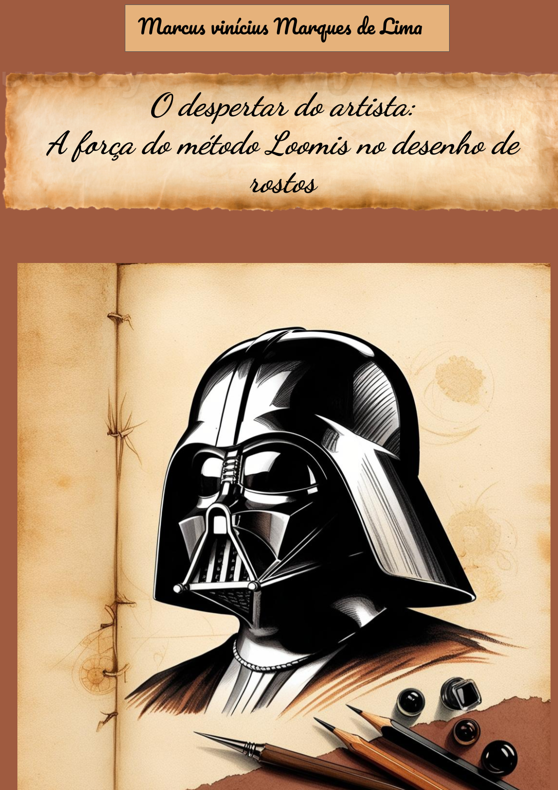

    

-------

# Projeto EBOOK Gerado por I.A.s

 > ℹ️ **NOTE:** Este é o repositório desenvolvido durante o curso no qual fui instrutor técnico na plataforma da [DIO](https://dio.me)

Projeto com o objetivo de gerar um ebook digital com as facilidades das ferramentas de IA. todos os prompts
seguem abaixo.

<a href="https://github.com/felipeAguiarCode/prompts-recipe-to-create-a-ebook/blob/main/output/ebook%20-%20css%20jedi%20output.pdf" title="View PDF now"> 📕Clique aqui para ler</a>

## 💻 Tecnologias utilizadas no projeto

- [ChatGPT](https://chat.openai.com/) 
- [Leonardo IA](https://leonardo.ai/)
- [PowerPoint](https://www.microsoft.com/en/microsoft-365/powerpoint)

## 🧠 Prompts

ChatGPT：

|   Ação   | prompt                                                                                                                                                                                                                                                                         |
| :------: | ------------------------------------------------------------------------------------------------------------------------------------------------------------------------------------------------------------------------------------------------------------------------------ |
|  título  | Crie um titulo de um ebook sobre o trema de desenhar rostos com o método de Loomis, o ebook é do nicho de artistas desde iniciantes até avançado, o título deve ser curto e direto, possuindo uma temática de Star wars no título, me liste 5 variações de titulos.|
| conteúdo | Escreva um texto descrevendo o que é o método Loomis para o desenho de rostos, sendo o texto escrito como se fosse feito por um metre jedi para seus padawans. Gostaria que o tom utilizado na escrita fosse de da forma mais clara para que uma pesso pode-se aprender sobre o assunto.
|

Leonardo IA：

|  Ação  | prompt                                                                                 |
| :----: | -------------------------------------------------------------------------------------- |
| título | A rendering of Darth Vader's iconic helmet, meticulously illustrated in the style of Leonardo da Vinci's Renaissance-era sketches, with bold, expressive lines and subtle sfumato shading, set against a warm, beige-toned paper background, with hints of gentle, aged wear, as if plucked from the pages of a 15th-century manuscript, the helmet's gleaming-black surface adorned with intricate, hand-drawn patterns and flourishes, while the artist's tools, a scattering of graphite pencils, inkwells, and quills, lie nearby, waiting to bring this Star Wars masterpiece to life in vivid, earthy tones of umber, sienna, and ochre.

## ✨ Features

- Conteúdo gerado via ChatGPT
- Imagens geradas via MidJourney

## 📚 Materiais

- Imagens utilizadas em `assets`
- ebook gerado durante as aulas em `output`

## 👨‍💻 Aluno

    
    
&nbsp&nbsp&nbsp Marcus Vinícius Marques de Lima 
    &nbsp&nbsp&nbsp
    Engenheiro Elétrico &nbsp;|&nbsp Desenvolvedor 
    &nbsp&nbsp&nbsp
    <a 
        href="https://github.com/Marcus-Lima99">
        GitHub
    </a>
    &nbsp;|&nbsp;
    <a 
        href="https://www.linkedin.com/in/marcusviniciuslima/">
        LinkedIn
    </a>

  

